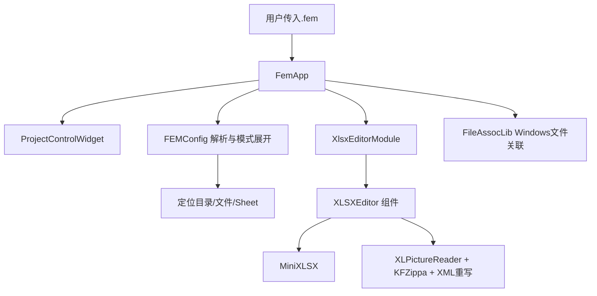

# FemApp 设计文档

## 1. 文档目的

本文档用于系统性说明 FemApp 的设计过程、软件逻辑框架、核心模块职责与演进历史。

---

## 2. 项目配置与设计

### 2.1 项目配置文件

文件后缀为`.fem`，首次运行软件后会自动绑定打开方式，点击文件可以使用软件打开

```fem
//是注释符号

在当前文件夹检索文件夹名，有重复的或者检索不到则报错
folder = *data*
//在指定的文件夹检索文件名，有重复的或者检索不到则报错
filename = *AT00580.27*
//在excel中检索sheet，有重复的或者检索不到则报错
sheet = *DNo.3*

//dose的range和Excel对应的列
dose={"mode":"LowHigh", "unit":"mJ/cm2","center":0, "step":0.05, "no": 23,"cols":"B:K"}

//focus的range和Excel对应的行
focus={"mode":"NegPos2", "unit":"μm","center":0, "step":0.03, "no": 29,"rows":"3:60"
}

//fem的要求
fem={"mode":"Focus2DoseLinear", "unit":"mJ/cm2","target":80, "spec":5}

```

软件通过读取该项目文件，完成以下操作：

1. **解析配置文件**，获取所需的参数
2. 根据初步获取到的参数，在项目文件夹中**解析**，对应到**唯一选项**
3. 如果项目配置异常，则在软件中可以**直接编辑修正**
4. 项目配置无误，则根据配置的表、区域展示数据，用于**用户筛选**
5. 将编辑的配置写回到项目配置、Excel 文件

### 2.2 设计思路

#### 先校验再编辑

- 启动流程采用“目录匹配 → 文件匹配 → Sheet 匹配”的逐级收敛。
- 每一级都要求结果合法且唯一；若匹配失败或多匹配，立即反馈并允许用户原位修正。

#### 双通道编辑模型

- 同时保留结构化模型（便于控件绑定）与原始文本（便于精确人工修订）。
- 文本应用后重新解析并回填 UI，确保文本编辑与表单编辑一致。

#### 低风险数据操作策略

- 采用 `dry-run` 与 `real-delete` 两阶段能力：`dry-run`模式下不执行实际的删除，而是在原本的文件中作标记，防止误操作
- 对真实删除采用分步骤保存（单元格写回、XML关系调整、媒体清理、重打包），降低文件损坏风险。

#### 模块解耦与可替换性

- 子模块设置
    | 模块           | 功能                                                         |
    | :------------- | :----------------------------------------------------------- |
    | `FemApp`       | 主程序，负责整体流程控制                                     |
    | `FemConfig`    | 配置文件管理，包括读取、解析、保存等。同时可以把不规范的格式保存为规范的格式 |
    | `MiniXLSX`     | 一个简单的 XLSX 处理库，用于读取文件、表格、图像数据，并编辑表格文件 |
    | `XLSXEditor`   | 独立的 XLSX 编辑器控件，独立开发后直接嵌入，便于维护。       |
    | `ProjectControlWidget` | 项目配置控件子包，承载项目操作与 Dose/Focus/FEM/Text 配置 UI，对外通过信号与接口交互。 |
    | `FileAssocLib` | 结合平台，负责文件类型绑定。                                 |

- 各模块通过清晰边界协作，便于单独升级或替换底层实现。

#### 渐进式迭代

- 逐功能独立开发，互相解耦
- 版本控制完善，确保代码风格，且每个版本都可以编译出软件

---

## 3. 开发过程

### 3.1 交付 #1（20260128）：项目配置编辑能力

**开发周期**：2026-01-26 - 2026-01-28

**交付目标**：完成 `.fem` 配置的加载、解析、匹配与可视化编辑主链路。

**交付范围**：UI 配置侧能力，不含原始文本编辑。

**关键 commit**：

- `556c0d8`：UI 与配置解析原型
- `33ce816`：文件夹/文件匹配展开
- `91b9ec9`：配置结果回填 UI
- `250e76f`：配置编辑能力基本完成

**验收结果**：可完成 `.fem` 的读取、字段匹配、参数编辑与保存前准备。

**已知边界**：文本编辑能力未包含在本次交付（后续由 `2063114` 补齐）。

### 3.2 交付 #2（20260212）：Excel 编辑首版（模拟删除）

**开发周期**：2026-01-29 - 2026-02-12

**交付目标**：打通 Excel 数据编辑链路并接入主界面，先交付可回退的“模拟删除”。

**交付范围**：图片加载、筛选、状态标记与界面联动。

**关键 commit**：

- `b7d9506`：`XLSXEditor` 主能力完成
- `5ee5120`：迁移到 `MiniXLSX` 处理 xlsx，优化图片读取速度
- `5e0ccf0`：编辑器集成主界面
- `5b49d43`：配置加载后自动刷新编辑器

**验收结果**：可按配置加载并筛选图片数据，保存时可执行标记删除（dry-run）。

**已知边界**：真实删除链路（关系清理/媒体清理/重打包）未在本次完整交付。

### 3.3 交付 #3（20260224）：Excel 编辑组件完善

**开发周期**：2026-02-20 - 2026-02-24

**交付目标**：提升编辑组件的稳定性、可维护性和交互一致性。

**交付范围**：组件更新、显示问题修复、能力开关完善。

**关键 commit**：

- `2c1319e`：更新 `XLSXEditor` 并修复长字符串显示问题
- `e306cbb`：修复长字符串导致控件尺寸异常
- `5574bb8`：主界面增加 `dry-run` 开关并联动编辑器

**验收结果**：Excel 编辑组件在稳定性、展示一致性和依赖治理方面达到可发布状态。

---

## 4. 总体架构



### 4.1 分层视角

1. **表现层（UI）**：`fem/src/femapp.*`（主容器与流程编排）+ `ProjectControlWidget`（配置界面）
2. **配置与规则层**：`FEMConfig`（解析、通配匹配、序列化）
3. **Excel 访问层**：`MiniXLSX`
4. **编辑执行层**：`XLSXEditor`（预览、删除标记、保存）
5. **平台能力层**：`FileAssocLib`（Windows 注册表关联）

### 4.2 核心依赖关系

- `FemApp` 依赖 `FEMConfig`、`MiniXLSX`、`XLSXEditor`、`ProjectControlWidget`
- `FEMConfig` 依赖 `MiniXLSX`
- `XLSXEditor` 依赖 `MiniXLSX` + `KFZippa` + `pugixml`
- `ProjectControlWidget` 依赖 `Qt6::Core` + `Qt6::Widgets`
- `FileAssocLib` 依赖 `Windows API`

---

## 5. 核心模块设计

### 5.1 `FemApp`（主控制器 + UI）

职责：

- 应用入口初始化（语言包、文件关联、命令行参数）
- 加载 `.fem` 后驱动全界面联动
- 调用编辑器模块进行范围内数据预览与编辑

关键设计点：

- `currentFilePath + isModified` 维护窗口标题和文件状态
- 通过 `ProjectControlWidget` 暴露的信号与接口驱动配置更新，`FemApp` 仅保留业务逻辑与状态管理

### 5.1.1 `ProjectControlWidget`（项目配置子包）

职责：

- 承载项目操作区（Load/Save/Folder/File/Sheet）与 `Dose/Focus/FEM/Text` 四个配置页 UI
- 通过统一信号上报用户输入，通过读写接口承接外部回填

关键设计点：

- 与主包解耦：不依赖 `FEMData`，仅处理控件与事件分发
- 主窗口 `mainwindow.ui` 已简化为容器布局，具体配置控件全部位于该子包

### 5.2 `FEMConfig`（配置语义核心）

职责：

- 读取与解析 `.fem` 文本（含多行块、注释、单双引号）
- 处理 `folder/filename/sheet` 通配匹配
- 结构化模型与文本双向转换（`ParseContent` / `dumpFEMData`）

关键设计点：

- 保留 `rawContent`，支持文本直改后重新解析
- 匹配流程采用“无通配符精确查找 + 有通配符遍历匹配”双路径
- `calculateNo` 支持列区间/行区间推导数量（用于一致性校验扩展）
- `dumpFEMData` 用来保存配置，并格式化为标准的格式

### 5.3 `MiniXLSX`（Excel 基础能力子模块）

职责：

- 打开/读取/写入 xlsx
- 工作表与单元格访问
- 图片信息提取与临时目录管理

关键价值：

- 将复杂的 xlsx/zip/xml 操作封装到稳定接口
- 降低主应用对底层库变动的敏感度

### 5.4 `XLSXEditor`（图片筛选与保存引擎）

职责：

- 根据 `表名 + 范围` 构建数据网格
- `DataItem` 级别执行保留/删除标记，将图片和描述文本打包展示
- 提供 **预览**、**全选**、**缩放**、**预览图片**
- 两种保存模式：`dry-run` 与 `real-delete`

保存策略：

1. **dry-run（假删除）**：仅对描述单元格设置红底（可逆）
2. **real-delete（真删除）**：
   - 写回并清空删除项描述
   - 关闭句柄后解包 xlsx
   - 修改 `drawing*.xml` 删除锚点
   - 修改 `drawing*.xml.rels` 删除关系
   - 清理无引用媒体文件
   - 重新打包并重开读写器

该分阶段策略有效规避了“直接保存破坏图片引用”的历史问题。

### 5.5 `FileAssocLib`

职责：

- 在 Windows 下注册/注销 `.fem` 文件关联

价值：

- 平台功能与业务逻辑解耦
- 同一套 UI 逻辑可在无 Windows API 环境下开发验证

---

## 6. 关键业务流程

### 6.1 配置加载流程

1. 用户打开 `.fem` 或通过命令行传入路径
2. `FEMConfig::ReadFile` 解析文本为 `FEMData`
3. `ExpandFolderPattern -> ExpandFilenamePattern -> ExpandSheetPattern` 逐级匹配
4. UI 回填 folder/file/sheet 与 dose/focus/fem 参数
5. 自动触发 `refreshXlsxEditor` 加载网格数据

### 6.2 编辑与保存流程

1. 双击 `DataItem` 描述框切换删除状态
2. 支持预览仅保留项/显示全部切换
3. 点击保存，根据 dry-run 开关分流：
   - dry-run：标红写回
   - real-delete：删除描述 + drawing/rels/media 真删除

### 6.3 配置文本编辑流程

1. 原始 `.fem` 文本显示在 `txtConfigRaw`
2. 用户修改并 `Apply`
3. `ParseContent` 重建 `FEMData`，失败即提示
4. 成功后重新加载全 UI（确保文本与控件一致）

---

## 7. 数据模型与配置约定

### `.fem` 核心字段：

- `folder`：目录匹配模式（支持通配）
- `filename`：Excel 文件匹配模式（支持通配）
- `sheet`：工作表匹配模式（支持通配）
- `dose`：列范围及剂量参数
- `focus`：行范围及焦距参数
- `fem`：目标和规格参数

### 工程上采用“**结构化模型 + 原始文本并存**”策略：

- 结构化模型用于 UI 与逻辑处理
- 原始文本用于保真展示和可回滚编辑

### Excel 数据源

- Sheet 中相邻两行对应的是实际的一行数据
- 第一行为图片数据（drawings），第二行是文本数据

---

## 8. 构建、部署

### 8.1 构建系统

CMake >= 3.14, Ninja >=1.13

### 8.2 构建流程

开发是在 Linux 下，因此提供了交叉编译的流程。

#### 安装依赖项

```bash
yay -Syu mingw-w64-toolchain mingw-w64	# 基础工具链
yay -S mingw-w64-cmake mingw-w64-extra-cmake-modules  # 适用于 MINGW64 的 CMake
yay -S mingw-w64-qt6-base mingw-w64-qt6-tools  # QT6
yay -S mingw-w64-pugixml mingw-w64-zlib  # pugixml：XML 文件操作；zlib：压缩包管理
yay -S mingw-w64-dllcopy # 一个小工具用来自动化复制所需的 dll
```

#### 构建

有一键构建脚本 `build.sh`

也可以输入命令来构建

```bash
# 生成 Windows 的调试版本
cmake -B build -G Ninja -DCMAKE_TOOLCHAIN_FILE=cmake/mingw64.cmake -DFEMAPP_ADD_WIN32=ON

# 生成 Windows 的正式版本（去除了调试信息，可以减小程序体积）
cmake -B build -G Ninja -DCMAKE_TOOLCHAIN_FILE=cmake/mingw64.cmake -DFEMAPP_ADD_WIN32=ON -DCMAKE_BUILD_TYPE=Release

# 构建
cmake --build build -j

# 为 Windows 构建时，因为不会自动在 MINGW 目录中寻找 DLL, 所以需要手动复制需要的 DLL 文件到 exe 目录。
# 为了保持整洁，可以考虑在新的文件夹中设置
mkdir -pv package
mkdir -pv package/translations
cp -r build/FemApp.exe package/
cp -r /usr/x86_64-w64-mingw32/lib/qt6/plugins/* package
cp -r translations/*.qm package/translations

export DLLPATH=/usr/x86_64-w64-mingw32/bin:/usr/x86_64-w64-mingw32/lib:./build
x86_64-w64-mingw32-dllcopy package/FemApp.exe ./dll.txt --verbose -r
```

---

## 9. 当前设计优点与不足

### 9.1 优点

- 模块边界清晰，主流程可追踪
- 配置驱动能力强，便于批量任务迁移
- dry-run/real-delete 双模式降低误删风险
- 对历史痛点（图片引用损坏）有明确工程绕行方案
- 开发过程中逐次优化性能，包括加载图片、保存文件的速度

### 9.2 不足

- `real-delete` 仍依赖 XML 结构约定（对极端 xlsx 变体需继续验证）
- `ParseJsonConfig` 为轻量解析器，容错与语法覆盖度有限
- 目前自动化测试覆盖有限，回归保障主要依赖手工验证

---

## 10. 后续演进计划

1. **配置解析增强**：引入更严格的语法校验与错误定位（行号/字段）
2. **保存安全增强**：real-delete 增加事务式备份与失败回滚
3. **架构分层**：将 `FemApp` 槽逻辑下沉到服务层，降低 UI 类复杂度
4. **测试体系**：补齐 FEMConfig 单测 + XLSXEditor 场景回归测试
